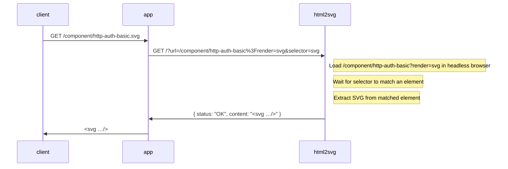

# Placeholder UI

``` shell
docker compose pull
docker compose up --detach --remove-orphans
open "http://$(docker compose port php 80)"
```

We use [html2svg](https://github.com/fathyb/html2svg) to convert HTML to SVG.

``` shell name=html2svg-example
#curl "http://$(docker compose port html2svg 3000)?url=https://example.com&selector=body"
curl "http://$(docker compose port html2svg 3000)?url=http://nginx:8080/component/input-text%3Frender_svg=1&selector=svg&timeout=1000"
```

> [!WARNING]
> html2svg looks abandoned. We may have to restore it to former glory.

See [`templates/component/http-auth-basic.html.twig`](templates/component/http-auth-basic.html.twig) for an example.

## Examples

<http://127.0.0.1:8888/component/http-auth-basic?>

-------------------------------------------------------------------------------

* <https://github.com/vgalin/html2image>
* <https://github.com/zumerlab/snapdom?tab=readme-ov-file>
* <https://hub.docker.com/r/dreamfeelings520/html2image>
  HTML to PNG (using Puppeteer)
* <https://chromium.googlesource.com/chromium/src/+/lkgr/headless/README.md>

## Converting HTML to SVG

We need a browser to render the HTML input before converting to SVG. This is done via a custom API server, `html2svg`,
using [Puppetteer](https://pptr.dev/) controlling a headless [Chrome browser](https://www.google.com/chrome/) running
[snapDOM](https://github.com/zumerlab/snapdom).



Note: For brevity the (internal) server names and ports, `http://html2svg:3000` and `http://phpfpm:8080`, are ommitted
from the diagram.
