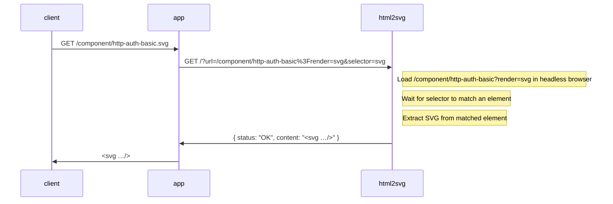

# Placeholder UI

Start the show with

``` shell
task site:update
task site:open
```

See [`templates/component/http-auth-basic.html.twig`](templates/component/http-auth-basic.html.twig) for an example.

## Converting HTML to SVG

We need a browser to render the HTML input before converting to SVG. This is done via a custom API server, `html2svg`,
using [Puppetteer](https://pptr.dev/) controlling a headless [Chrome browser](https://www.google.com/chrome/) running
[snapDOM](https://github.com/zumerlab/snapdom).



Note: For brevity the (internal) server names and ports, `http://html2svg:3000` and `http://phpfpm:8080`, are ommitted
from the diagram.
